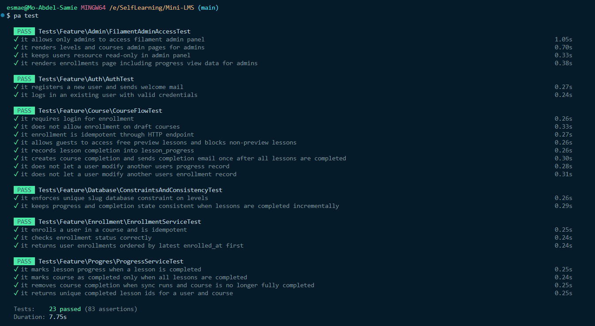

# Mini-LMS

Mini-LMS is a modular Laravel 12 learning platform built with `nwidart/laravel-modules`, Filament admin, and Pest tests.

## Tech Stack

- PHP 8.2
- Laravel 12
- Nwidart Laravel Modules
- Filament v3 + Filament Shield
- Livewire 3 + Volt
- Tailwind + Vite 
- Alpine.js
- Pest

## Setup

1. Install dependencies:

```bash
composer install
npm install
```

2. Create environment file and app key:

```bash
cp .env.example .env
php artisan key:generate
```

3. Configure database in `.env`.

```env
DB_CONNECTION=mysql
DB_HOST=127.0.0.1
DB_PORT=3306
DB_DATABASE=
DB_USERNAME=
DB_PASSWORD=
```

4. Run migrations:

```bash
php artisan migrate
```

5. Seed initial data:

```bash
php artisan db:seed
```

6. Run the app:

```bash
php artisan serve
npm run dev
or  
composer run dev
```

## Seed Data

`php artisan db:seed` currently runs to:

- Create 1 users
  - userName: <user@user.test>
  - password: 123456789
- Create 1 admin
  - userName: <admin@admin.test>
  - password: 123456789

- Creates 3 levels: Beginner, Intermediate, Advanced
- Creates 3 sample courses
- Creates 2-3 lessons per course random free_preview value.
- Create the base roles and permissions (Admin, Super admin, User)

## How to Run Tests

Configure database in `.env.testing`.

```env
APP_ENV=testing
APP_KEY=

DB_CONNECTION=mysql
DB_HOST=127.0.0.1
DB_PORT=3306
DB_DATABASE=
DB_USERNAME=
DB_PASSWORD=
```

Key generate
```bash
php artisan key:generate --env=testing
```

Run all tests:

```bash
./vendor/bin/pest
```

Current test suite includes:
- Fearutes

## Test Evidence (All Passing)

Latest local run result:

- `23 passed`
- `83 assertions`

Artifacts:

- Screenshot: `docs/screenshots/tests-passed.png`



## Assumptions and Limitations

- No payment methods.
- Enrollment by clicking button without any payment flow.

## If I Had More Time

- Add deterministic seeding mode for reproducible demo data.
- Apply cache strategy for accessing course info.
- Expand test coverage.
- Standardize all modules on thin Action -> Service -> Repository layering.
- Implement github workflow actions.  