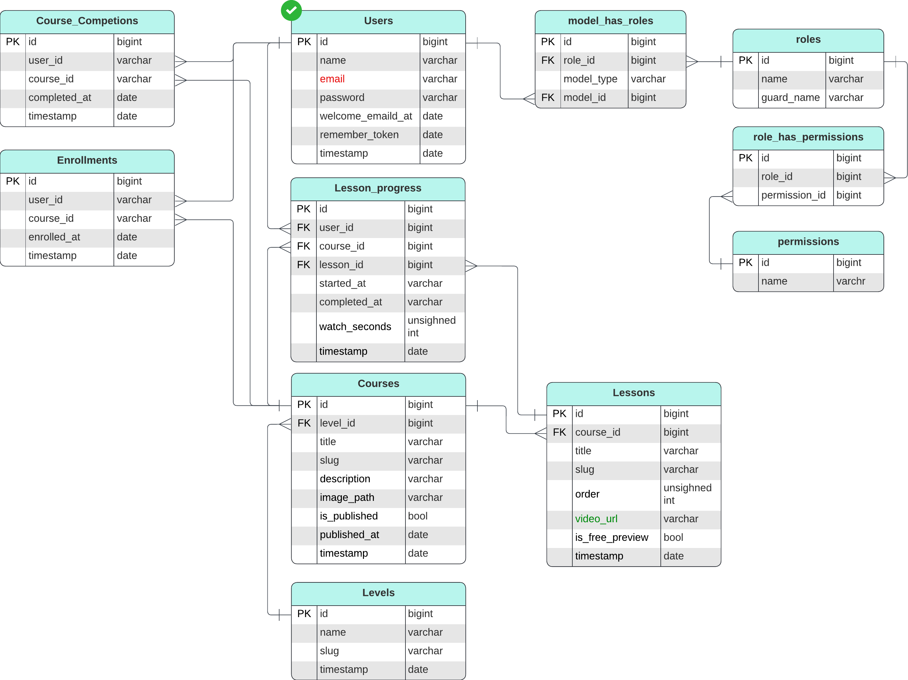

# Architecture

Mini-LMS is a modular Laravel 12.

## Project Structure

- Domain modules under `Modules/*`:
  - `Core`
  - `Level`
  - `Course` 
  - `Enrollment`
  - `Progress`
- Module route providers load each module’s `routes/web.php`.

## ERD

## Layering Pattern (Follow)

The project is moving to thin route Actions and module service layers.

- Route -&gt; Invokable Action
- Action -&gt; Service Interface
- Service -&gt; Repository Interface(s) + other services
- Repository -&gt; Eloquent/DB access

## Data Integrity Rules

- `levels.slug` is unique.
- `courses.slug` is unique.
- `lessons.slug` is unique and generated per lesson save; uniqueness is enforced by DB.
- `lessons` also enforce unique `(course_id, order)`.
- Enrollment flow is idempotent (`firstOrCreate`).

## Routes
### Web Pages

| Method | URI | Name   | Auth |
| ------ | --- | ------ | ---- |
| GET    | `/` | `home` | ❌    |

### Authenticate(web)

| Method | URI         | Name             | Middleware / Notes |
| ------ | ----------- | ---------------- | ------------------ |
| GET    | `/login`    | `login`          | `guest`            |
| POST   | `/login`    | `login.store`    | `guest`            |
| GET    | `/register` | `register`       | `guest`            |
| POST   | `/register` | `register.store` | `guest`            |
| POST   | `/logout`   | `logout`         | `auth`             |

### Courses

| Method | URI                                           | Name                       | Auth / Notes          |
| ------ | --------------------------------------------- | -------------------------- | --------------------- |
| GET    | `/courses/{course}`                           | `courses.show`             | ❌                     |
| POST   | `/courses/{course}/enroll`                    | `courses.enroll`           | ✅ `auth` + `verified` |
| GET    | `/courses/{course}/lessons/{lesson}`          | `courses.lessons.show`     | ❌                     |
| POST   | `/courses/{course}/lessons/{lesson}/progress` | `courses.lessons.progress` | ✅ `auth` + `verified` |

## UI Behavior (Implemented)

- Home lists published courses.
- Course details page shows all lessons.
- Non-enrolled users can watch only lessons flagged `is_free_preview = true`.
- Enrolled users can watch all course lessons.
- Lessons collapse.
- Progress bar tracking.
- Completion tag while completed.
